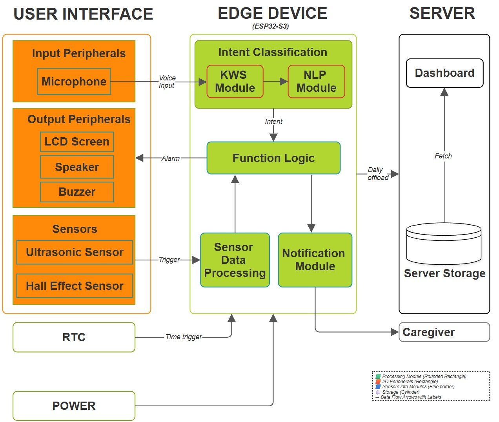

# AIoT Health: Medicine Reminder For The Elderly — Offline Voice-Interactive Medicine Adherence System

An ESP32-S3 based TinyML system designed to improve medication adherence 
in elderly patients, including those with dementia or Alzheimer's. The 
device runs entirely offline on ~$15 of hardware with no cloud dependency 
— a hard design constraint given the target users and deployment context.

Medication non-adherence causes ~125,000 deaths and over $100 billion in 
avoidable healthcare costs annually in the US alone. Existing solutions 
assume smartphones, stable internet, or active caregiver presence. This 
system assumes none of those.

**Published research:** Accepted, Springer LNNS — [arXiv link when live]

---

## System Architecture



The full pipeline:

1. Alarm triggers at scheduled medication time via RTC
2. OLED display shows prompt, speaker plays pre-recorded TTS
3. User responds verbally
4. KWS model continuously monitors audio — detects medicine-related 
   command trigger
5. SLU model activates, classifies response into one of 8 intent 
   categories
6. Physical sensors cross-validate:
   - Hall effect sensor confirms pillbox lid was opened
   - Ultrasonic sensor confirms hand was placed inside
7. Based on combined result: adherence logged, caregiver email sent, 
   or reminder re-triggered
8. All inference runs locally on ESP32-S3 — no internet required 
   except for optional email notification

Full state machine documentation: [State Machine](docs/state_machine.md)

---

## Key Technical Details

**KWS Model**
- Architecture:2D CNN (Conv2D on MFE spectrogram features)
- Input: 49×40 MFE feature matrix
- Accuracy: 96.4%
- Inference latency: ~30ms on ESP32-S3 @ 240MHz
- Flash: ~0.7MB | SRAM: 130KB
- Quantization: int8 post-training, <2% accuracy drop vs float32

**SLU Model**
- Architecture: Embedding + GlobalAveragePooling + Dense
- Input: tokenized + padded text, vocab=1500, max_len=15
- Accuracy:  94.1%
- Inference latency: ~75ms
- Flash: ~1.1MB | SRAM: 200KB
- Quantization: int8 post-training

**8 Intent Categories**
| Intent | Example Input | Action |
|--------|--------------|--------|
| confirm_taken | "yes", "I took it" | Trigger sensor verification |
| deny_taken | "no", "I didn't" | Reschedule alarm |
| remind_later | "snooze", "30 minutes" | Postpone by extracted delay |
| ask_med_details | "which medicine?" | Read from medicine registry |
| ask_schedule | "when is my next dose?" | Read reminder queue |
| ask_time | "what time is it?" | RTC lookup + TTS |
| notify_sos | "help", "emergency" | Bypass confirmation, alert caregiver |
| irrelevant | out-of-scope queries | Confidence below threshold, do nothing |

**Hardware Constraints**
- Tensor arena allocated in PSRAM via EXT_RAM_BSS_ATTR
- Arena size tuned empirically — start high, reduce until stable
- MicroMutableOpResolver used (not AllOpsResolver) — registers only 
  ops the model actually uses, saving ~40KB SRAM

---

## Hardware

| Component | Model | Purpose | Supply |
|-----------|-------|---------|--------|
| MCU | ESP32-S3 Mini C3 | Inference + control | 3.3V |
| Microphone | INMP441 (I²S MEMS) | Voice capture | 3.3V |
| Display | SSD1306 OLED | User prompts | 3.3V |
| Ultrasonic | HC-SR04 | Hand presence detection | 5V |
| Hall effect | A3144 | Pillbox lid state | 3.3V |
| Amplifier | PAM8403 | Speaker output | 5V |
| Buzzer | Active buzzer | Alert output | 5V/GPIO |
| Speaker | 3W 8Ω | TTS playback | Via PAM8403 |

**Total approximate cost: ~$15**


Full wiring, pin connections, and component rationale: [Hardware Setup](docs/hardware_setup.md)

---

## Repository Structure
```
AlzhAImers/
├── README.md
├── LIMITATIONS_AND_FUTURE_WORK.md
├── firmware/                   ESP32-S3 sketch divided by component
├── models/
│   ├── kws/                    Keyword spotting model
│   └── slu/                    Spoken language understanding model
└── docs/                       Diagrams, hardware, state machine
```

---

## Limitations

This system has real limitations documented honestly.  
See [LIMITATIONS_AND_FUTURE_WORK](LIMITATIONS_AND_FUTURE_WORK.md)

Core open problems:
- KWS and SLU trained on single speaker — degrades on unseen voices 
  and regional accents
- Firmware does not adapt dynamically to changing acoustic conditions
- Sensor alignment sensitive — misalignment causes false positives
- Real-world multi-user trial data not yet collected

---

## Paper

**AIoT Health: Medicine Reminder For The Elderly**  
Shrivansh Pratap Singh, Manoj Kumar Gupta  
Accepted: ICDECT-2025, Springer Lecture Notes in Networks and Systems (LNNS)  
Preprint: [Zenodo](https://zenodo.org/records/19034554)  
arXiv: pending endorsement

Check: [Pre Print](docs/paper_preprint.md) 

This repository contains the complete implementation including hardware 
decision rationale, training decisions, engineering challenges and 
workarounds, and failure modes that could not be included in the paper 
due to space constraints.

---

## Setup

To replicate and setup check: [SETUP](firmware/SETUP.md)
