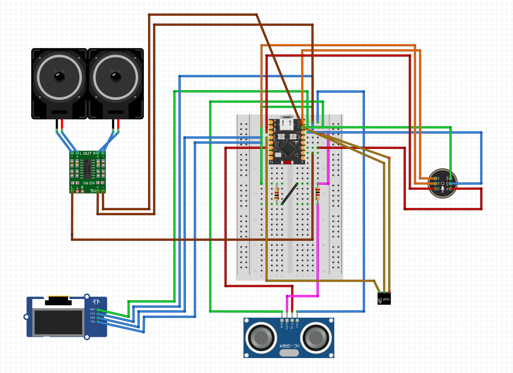
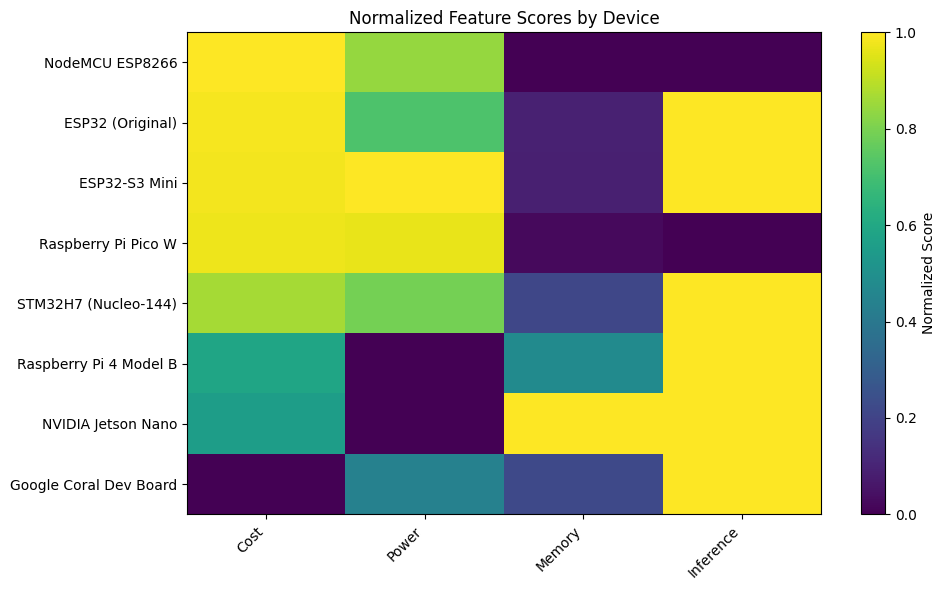
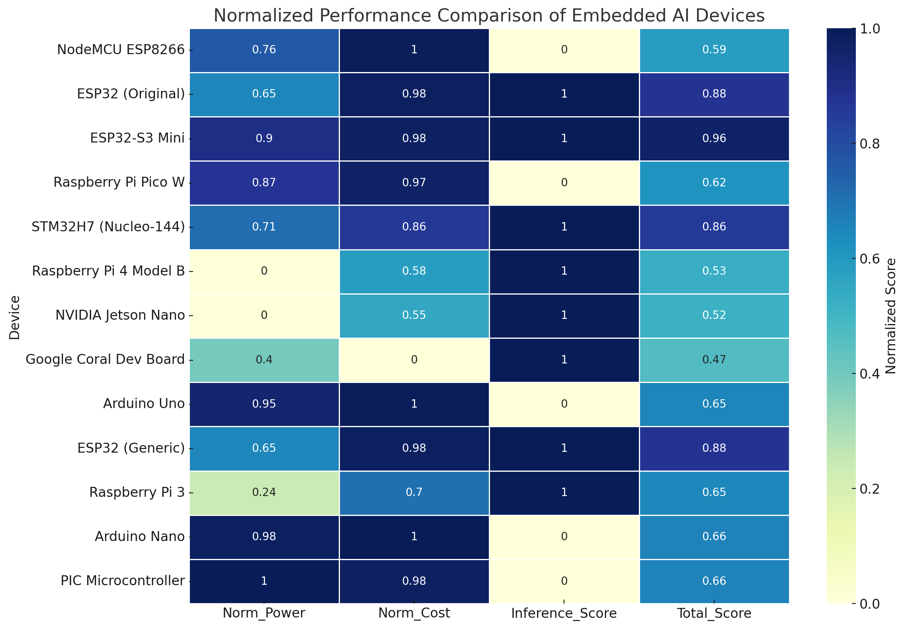

# Hardware Setup

---

## Component Selection Rationale

### ESP32-S3 Mini C3
Chosen over ESP32 classic for three specific reasons:
1. Dual-core Xtensa LX7 @ 240MHz with vector extensions 
   that accelerate fixed-point convolution — directly 
   relevant to TFLite Micro quantized inference
2. External PSRAM support (up to 4MB) — critical for 
   tensor arena allocation without exhausting internal SRAM
3. Deep-sleep current sub-5µA — enables battery operation 
   for days to weeks

### INMP441 (I²S MEMS Microphone)
Digital I²S output preferred over analog mic for:
- Higher SNR and immunity to EMI
- No ADC required — direct digital interface
- Hardware PDM to PCM conversion and filtering in transducer
Configured: 16kHz, 16-bit mono, 4 DMA buffers of 512 samples

### A3144 Hall Effect Sensor
Digital output (not analog) — simple HIGH/LOW lid state 
with sub-millisecond latency. Paired with neodymium disc 
magnet epoxied to lid interior. Closed = LOW, Open = HIGH.

### HC-SR04 Ultrasonic
Chosen for cost ($0.50) and straightforward echo-pulse 
interface. Mounted flush on interior tray wall, measures 
distance to opposite wall. Baseline calibrated when empty, 
threshold = d_empty - 10mm. Hand insertion reduces measured 
distance below threshold.

Note: HC-SR04 operates on 5V and echo pin outputs 5V — 
requires voltage level shifting for 3.3V ESP32-S3 GPIO.

### PAM8403 + 3W 8Ω Speaker
Class D amplifier for TTS playback. Low cost, adequate 
output for a bedside device. Audio input via PWM/LEDC 
channel at ~20kHz.

---
## Wiring Diagram

## Pin Connections

### INMP441 Microphone (I²S)

| Mic Pin | ESP32-S3 GPIO | Notes |
|---------|--------------|-------|
| VCC | 3.3V | |
| GND | GND | |
| WS (LRCLK) | GPIO 15 | I2S_WS, configured in i2s_config_t |
| SCK (BCLK) | GPIO 14 | I2S_BCK |
| SD (DATA) | GPIO 16 | I2S_IN |

### A3144 Hall Effect Sensor
| Sensor Pin | ESP32-S3 GPIO | Notes |
|-----------|--------------|-------|
| VCC | 3.3V | |
| GND | GND | |
| OUT | GPIO 2 | Interrupt-capable, lid-open detection |

### HC-SR04 Ultrasonic
| Sensor Pin | ESP32-S3 GPIO | Notes |
|-----------|--------------|-------|
| VCC | 5V rail | |
| GND | GND | |
| TRIG | GPIO 5 | Digital out |
| ECHO | GPIO 18 | Via voltage divider: 2kΩ+1kΩ, interrupt-capable |

### SSD1306 OLED (I²C)
| Display Pin | ESP32-S3 GPIO | Notes |
|------------|--------------|-------|
| VCC | 3.3V | |
| GND | GND | |
| SDA | GPIO 21 | Shared I²C bus with RTC |
| SCL | GPIO 22 | Shared I²C bus with RTC |

### PAM8403 Amplifier
| Amp Pin | ESP32-S3 GPIO | Notes |
|---------|--------------|-------|
| VCC | 5V rail | |
| GND | GND | |
| R_IN | GPIO 17 | PWM/LEDC ch0 ~20kHz |
| L_IN | — | Unconnected (mono) |
| R+ | Speaker + | 3W 8Ω speaker |

---

## Engineering Challenges and Solutions

### 1. HC-SR04 Voltage Level Shifting
**Problem:** HC-SR04 echo pin outputs 5V. ESP32-S3 GPIO 
maximum is 3.3V. Direct connection damages GPIO.

**Solution:** use 10kΩ and 20kΩ for proper 5→3.3V:
- 10kΩ between echo and GPIO
- 20kΩ between GPIO and GND  
- Output: 5V × (20kΩ/30kΩ) = 3.33V 

### 2. Limited GPIOs
**Problem:** I²S, I²C, UART, PWM, and sensor interrupts 
exhausted available ESP32-S3 Mini C3 GPIO.

**Solution:**
- Pin-multiplexing audit before any wiring
- Dedicated interrupt-capable pins for I²S mic and 
  ultrasonic echo (timing-critical)
- OLED and RTC share I²C bus on SDA/SCL
- PCF8574 I²C expander added for non-timing-sensitive 
  buttons and LEDs

### 3. Breadboard EMI Noise in Mic
**Problem:** Long jumper wires induced EMI in I²S mic line, 
causing false wake-word triggers and noisy SLU inputs.

**Solution:**
- Shortened all wiring runs to mic
- 0.1µF decoupling capacitor on mic VCC pin
- Software noise gate: only process audio frames where 
  RMS amplitude exceeds programmable threshold

### 4. PAM8403 Startup Surge
**Problem:** Speaker amplifier voltage surge on startup 
caused brief 5V rail dip, resetting ESP32-S3.

**Solution:** 100µF bulk electrolytic capacitor on 5V rail, 
placed close to PAM8403 VCC pin.

### 5. Sensor Alignment Sensitivity
**Problem:** Hall sensor and ultrasonic readings highly 
sensitive to minor misalignment, causing false events.

**Solution:**
- Hardware jig to position neodymium magnet within 5mm 
  tolerance of A3144, then epoxied in place
- Ultrasonic: characterized echo times across known 
  distances, derived linear compensation curve
- Firmware: median filter over 5 consecutive ultrasonic 
  readings — hand_present only if ≥3 of 5 below threshold

### 6. Model Memory Overflow
**Problem:** Initial quantized KWS + SLU together pushed 
RAM to limit causing stack overflows.

**Solution:**
- Switched from per-channel symmetric to per-tensor 
  asymmetric quantization: ~10KB saved without accuracy loss
- Feature extraction buffers moved to statically 
  allocated PSRAM
- Non-critical SLU layers pruned

---
## MCU Selection Analysis

Selecting the right microcontroller for this system required balancing three competing constraints: the device must support local TFLite Micro inference, consume low enough power for 7+ day battery operation, and cost little enough to keep the total BOM under $15. A normalized comparison was conducted across 13 candidate devices to make this decision systematic rather than arbitrary.

### Scoring Methodology 

The normalized total score reflects a weighted balance across three criteria, each chosen for direct relevance to the deployment context: 
- **Local inference capability** — hard requirement. Any device that cannot run TFLite Micro is disqualified regardless of other scores. Devices without inference support receive 0 on this dimension and cannot rank highly regardless of cost or power advantages. 
- **Power efficiency** — normalized inversely to power draw. Lower mA = higher score. Critical for achieving the target runtime of 7+ days per charge on a standard power bank. 
- **Cost** — normalized inversely to price. Lower cost = higher score. With a target BOM under $15 total, MCU cost directly constrains what is left for sensors, display, and audio hardware. 

The score is deliberately not a measure of raw compute performance. High-capability devices like the NVIDIA Jetson Nano (4GB RAM, $59) and Google Coral Dev Board ($129) are technically capable of better inference accuracy but score poorly because they are the wrong tool for this deployment context — a device that drains a battery in hours or costs more than the entire remaining BOM is not viable for a home healthcare device targeting elderly users in low-income settings.

### Results

| Device | Power (WiFi TX) | Memory / Flash | Cost (USD) | Local Inference | Norm. Total Score |
|--------|----------------|----------------|------------|-----------------|-------------------|
| ESP32-S3 Mini | 80mA | 512KB / 8MB | $5.0 | Yes | **0.96** |
| ESP32 (Original) | 240mA | 520KB / 4MB | $4.5 | Yes | 0.88 |
| ESP32 (Generic) | 240mA | 520KB / 4MB | $4.5 | Yes | 0.88 |
| STM32H7 (Nucleo-144) | 200mA | 1MB / ext. | $20.0 | Yes | 0.86 |
| Arduino Nano | 30mA | 2KB / 32KB | $2.5 | No | 0.66 |
| PIC Microcontroller | 20mA | Variable | $5.0 | No | 0.66 |
| Arduino Uno | 50mA | 2KB / 32KB | $3.0 | No | 0.65 |
| Raspberry Pi 3 | 500mA | 1GB / SD | $40.0 | Yes | 0.65 |
| Raspberry Pi Pico W | 100mA | 264KB / 2MB | $6.0 | No | 0.62 |
| NodeMCU ESP8266 | 170mA | 160KB / 4MB | $3.0 | No | 0.59 |
| Raspberry Pi 4B | 650mA | 2-8GB / SD | $55.0 | Yes | 0.53 |
| NVIDIA Jetson Nano | 650mA | 4GB / SD | $59.0 | Yes | 0.52 |
| Google Coral Dev Board | 400mA | 1GB / eMMC | $129.0 | Yes | 0.47 |

Three distinct failure modes emerge from the data. Arduino-class boards (Nano, Uno, Pico W) score well on power and cost but cannot run local inference — immediately disqualified. High-compute boards (Jetson Nano, Coral, Raspberry Pi 4) support inference but draw 400-650mA and cost $55-$129 — unsuitable for battery operation and incompatible with the cost constraint. Mid-range capable devices (STM32H7) support inference but cost $20 and lack integrated WiFi, adding integration overhead. The ESP32-S3 Mini scores 0.96 — highest among all inference-capable candidates — because it is the only device without a critical weakness in any relevant dimension. A secondary feature-level comparison of the top candidates confirmed this:

The ESP32-S3 Mini is the only device that scores consistently across all four dimensions simultaneously. Every alternative involves a meaningful tradeoff that conflicts with at least one hard requirement of this deployment.